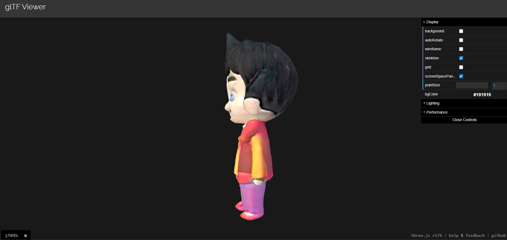
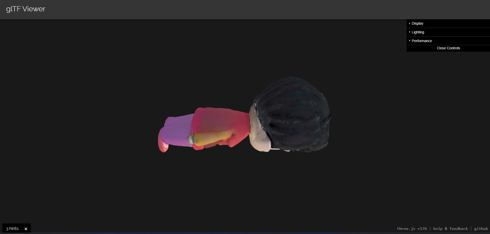

# Task 1: 2D → 3D Model Generation (Local Version)

Generate 3D models from 2D images using **TripoSR** from Hugging Face.

## Demo

### Input Image


### 3D Model Viewer
Download and view the 3D model rotation video: [**3D-viewer.mp4**](3D-viewer.mp4)

The video shows the generated 3D model rotating to display all angles of the reconstruction.

### 3D Model Screenshots

<p float="left">
  
  
  
</p>

## Model Used
- **Model:** [stabilityai/TripoSR](https://huggingface.co/stabilityai/TripoSR)
- **License:** MIT
- **Description:** Fast feed-forward 3D reconstruction from a single image

## Requirements

- Python 3.8+
- ~6GB RAM (for inference)
- GPU optional (CUDA) - runs on CPU too, but slower

## Setup (Local)

### 1. Create virtual environment (recommended)

```bash
# Create venv
python -m venv venv

# Activate (Linux/Mac)
source venv/bin/activate

# Activate (Windows)
venv\Scripts\activate
```

### 2. Install PyTorch

**With GPU (CUDA 11.8):**
```bash
pip install torch torchvision --index-url https://download.pytorch.org/whl/cu118
```

**CPU only:**
```bash
pip install torch torchvision --index-url https://download.pytorch.org/whl/cpu
```

### 3. Install dependencies

```bash
pip install -r requirements.txt
```

**For GPU users**, also install:
```bash
pip install onnxruntime-gpu
```

## Usage

### Simple usage:
```bash
python generate_3d.py input.jpg
```

### With custom output:
```bash
python generate_3d.py input.jpg --output my_output --output-name model.glb
```

### Skip setup (if already cloned TripoSR):
```bash
python generate_3d.py input.jpg --skip-setup
```

## Input/Output

### Input
- Single 2D image (PNG, JPG, JPEG)
- Works best with clear object photos
- Simple or transparent backgrounds preferred

### Output
- `output_model.glb` - Binary glTF format (default)
- Also generates `.obj` file in output directory

## File Structure

```
2D-to-3D/
├── generate_3d.py      # Main script
├── requirements.txt    # Dependencies
├── README.md           # This file
├── TripoSR/            # Auto-cloned repository
└── output/             # Generated 3D models
    ├── 0/
    │   └── mesh.obj
    └── output_model.glb
```

## Troubleshooting

### "ModuleNotFoundError: No module named 'onnxruntime'"
```bash
pip install onnxruntime
# or for GPU:
pip install onnxruntime-gpu
```

### "ImportError: cannot import name 'split_torch_state_dict_into_shards'"
```bash
pip install --upgrade huggingface_hub accelerate transformers
```

### "CUDA out of memory"
Run with CPU by setting:
```bash
export CUDA_VISIBLE_DEVICES=""
python generate_3d.py input.jpg
```

### torchmcubes issues (Windows without build tools)

If you get: `CMake Error: CMAKE_CXX_COMPILER not set` or `running 'nmake' failed`

The repository includes a workaround using scikit-image's marching_cubes. This should work automatically. If not:

**Option 1: Install Build Tools (Recommended)**
- Download "Visual Studio Build Tools" from Microsoft
- Include "Desktop development with C++"
- Then: `pip install git+https://github.com/tatsy/torchmcubes.git`

**Option 2: Use the included scikit-image fallback** 
- Already configured in this version
- Runs on CPU and Windows without build tools
- Slightly different mesh quality than the original torchmcubes

## Improvement Proposals

### 1. Better Quality
- Use higher marching cubes resolution
- Apply mesh smoothing and decimation
- Use multi-view models like InstantMesh

### 2. Faster Runtime
- TensorRT or ONNX optimization
- Batch processing for multiple images

### 3. Multi-view Support
- Integrate Wonder3D or Zero123++
- Photogrammetry for real multi-view input

### 4. Texture Improvements
- Use `--bake-texture` flag: `python run.py image.jpg --bake-texture`
- Diffusion-based texture generation

### 5. Post-processing
- Mesh simplification for web
- Automatic rigging for animation
- PBR material generation
